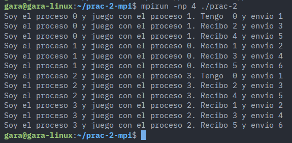

# Práctica 2 – Comunicación punto a punto con MPI

**Asignatura:** Computación Distribuida para la Gestión de Datos a Gran Escala  
**Módulo:** 4 – Open MPI  
**Autor:** Javier Francisco Dibo Gómez

---

## 1. Descripción del problema

El objetivo de la práctica es implementar un programa MPI que simule un juego de ping-pong entre pares de procesos. Las reglas son:

- Los procesos se emparejan de dos en dos: el proceso par `X` juega con el proceso `X+1`.
- El proceso par inicia el juego enviando un número a su pareja.
- El proceso que recibe suma 1 al valor recibido y lo devuelve al emisor.
- Cada par disputa **6 toques en total** (3 por cada proceso).
- Si el número de procesos es impar, el programa termina con un mensaje de error.
- En cada toque, el proceso activo imprime: `Soy el proceso X y juego con el proceso Y. Recibo N y envío N+1`.

---

## 2. Diseño de la solución

### 2.1 Emparejamiento

Se utiliza el rango de cada proceso para determinar si es par o impar y quién es su pareja:

| Proceso (rango) | Tipo  | Pareja     |
|-----------------|-------|------------|
| 0               | par   | 1 (rango+1)|
| 1               | impar | 0 (rango-1)|
| 2               | par   | 3 (rango+1)|
| 3               | impar | 2 (rango-1)|
| ...             | ...   | ...        |

### 2.2 Dinámica del juego

Cada par ejecuta 3 iteraciones de bucle. En cada iteración:

- El proceso **par** imprime su toque, incrementa el valor y lo envía (`MPI_Send`), luego espera la respuesta (`MPI_Recv`).
- El proceso **impar** espera el valor (`MPI_Recv`), imprime su toque, incrementa y envía de vuelta (`MPI_Send`).

Esto produce la siguiente secuencia de mensajes para el par (0, 1), comenzando con `valor = 0`:

```
Proceso 0 → envía 1  → Proceso 1
Proceso 1 → envía 2  → Proceso 0
Proceso 0 → envía 3  → Proceso 1
Proceso 1 → envía 4  → Proceso 0
Proceso 0 → envía 5  → Proceso 1
Proceso 1 → envía 6  → Proceso 0
```

6 envíos en total (3 por proceso), cumpliendo el enunciado.

### 2.3 Gestión del error por número impar de procesos

Se obtiene el rango **antes** de la comprobación de paridad para que únicamente el proceso 0 imprima el mensaje de error, evitando salidas duplicadas.

---

## 3. Instrucciones MPI empleadas

### `MPI_Init`

```c
MPI_Init(&argc, &argv);
```

Inicializa el entorno de ejecución MPI. Debe ser la primera llamada MPI del programa. Recibe los argumentos de línea de comandos para que MPI pueda procesarlos si es necesario.

---

### `MPI_Comm_size`

```c
MPI_Comm_size(MPI_COMM_WORLD, &num);
```

Obtiene el número total de procesos que participan en el comunicador `MPI_COMM_WORLD`. El resultado se almacena en `num` y se usa para verificar que el número de procesos es par antes de continuar.

---

### `MPI_Comm_rank`

```c
MPI_Comm_rank(MPI_COMM_WORLD, &rango);
```

Obtiene el identificador único (rango) del proceso actual dentro del comunicador. Los rangos van de `0` a `num-1`. Se usa para:

- Determinar si el proceso es par o impar.
- Calcular el rango de la pareja.
- Limitar el mensaje de error al proceso 0.

---

### `MPI_Send`

```c
MPI_Send(&valor, 1, MPI_INT, mi_pareja, 0, MPI_COMM_WORLD);
```

Envío bloqueante punto a punto. Los parámetros son:

| Parámetro      | Valor          | Significado                              |
|----------------|----------------|------------------------------------------|
| `&valor`       | dirección      | Buffer con el dato a enviar              |
| `1`            | count          | Número de elementos (uno solo)           |
| `MPI_INT`      | datatype       | Tipo del dato (entero)                   |
| `mi_pareja`    | dest           | Rango del proceso destino                |
| `0`            | tag            | Etiqueta del mensaje (0 por convención)  |
| `MPI_COMM_WORLD` | comm         | Comunicador global                       |

La llamada bloquea al proceso emisor hasta que el mensaje ha sido enviado de forma segura (el buffer puede reutilizarse).

---

### `MPI_Recv`

```c
MPI_Recv(&valor, 1, MPI_INT, mi_pareja, 0, MPI_COMM_WORLD, MPI_STATUS_IGNORE);
```

Recepción bloqueante punto a punto. Los parámetros coinciden con `MPI_Send` en tipo y tag, con dos diferencias:

| Parámetro        | Valor             | Significado                                       |
|------------------|-------------------|---------------------------------------------------|
| `&valor`         | dirección         | Buffer donde se almacena el dato recibido         |
| `mi_pareja`      | source            | Rango del proceso del que se espera el mensaje    |
| `MPI_STATUS_IGNORE` | status        | Se ignora la información de estado del mensaje    |

La llamada bloquea al proceso receptor hasta que el mensaje llega. Se usa `MPI_STATUS_IGNORE` porque no es necesario consultar metadatos del mensaje (origen real, tag, tamaño).

---

### `MPI_Finalize`

```c
MPI_Finalize();
```

Finaliza el entorno MPI y libera los recursos asociados. Debe ser la última llamada MPI del programa. Se invoca tanto en el flujo normal como en el caso de error (número impar de procesos), asegurando una terminación limpia en todos los casos.

---

## 4. Código fuente

```c
#include <stdio.h>
#include <mpi.h>

int main(int argc, char* argv[]) {

    MPI_Init(&argc, &argv);

    int num, rango;
    MPI_Comm_size(MPI_COMM_WORLD, &num);
    MPI_Comm_rank(MPI_COMM_WORLD, &rango);

    if (num % 2 != 0) {
        if (rango == 0)
            printf("Se necesita un número par de procesos.\n");
        MPI_Finalize();
        return 0;
    }

    int es_par;
    if (rango % 2 == 0)
        es_par = 1;
    else
        es_par = 0;
    int mi_pareja;

    if (es_par)
        mi_pareja = rango+1;
    else
        mi_pareja = rango-1;

    int valor = 0;
    int contador = 0;

    while (contador < 3) {
        if (es_par) {
            printf("Soy el proceso %d y juego con el proceso %d. Recibo %d y envío %d\n",
                   rango, mi_pareja, valor, valor+1);
            valor++;
            MPI_Send(&valor, 1, MPI_INT, mi_pareja, 0, MPI_COMM_WORLD);
            MPI_Recv(&valor, 1, MPI_INT, mi_pareja, 0, MPI_COMM_WORLD, MPI_STATUS_IGNORE);
        }
        else {
            MPI_Recv(&valor, 1, MPI_INT, mi_pareja, 0, MPI_COMM_WORLD, MPI_STATUS_IGNORE);
            printf("Soy el proceso %d y juego con el proceso %d. Recibo %d y envío %d\n",
                   rango, mi_pareja, valor, valor + 1);
            valor++;
            MPI_Send(&valor, 1, MPI_INT, mi_pareja, 0, MPI_COMM_WORLD);
        }
        contador++;
    }

    MPI_Finalize();
    return 0;
}
```

---

## 5. Decisiones de diseño

**Comunicación bloqueante (`MPI_Send` / `MPI_Recv`).**
Se eligieron las funciones bloqueantes estándar porque la lógica del juego es estrictamente secuencial dentro de cada par: un proceso no puede enviar su respuesta hasta haber recibido el golpe anterior. Las funciones no bloqueantes (`MPI_Isend` / `MPI_Irecv`) no aportarían ninguna ventaja aquí y complicarían el código innecesariamente.

**Tag fijo a 0.**
Dado que cada proceso solo se comunica con una única pareja, no hay ambigüedad en los mensajes. No es necesario usar tags distintos por iteración.

**`MPI_STATUS_IGNORE` en `MPI_Recv`.**
El origen del mensaje es siempre conocido (`mi_pareja`), por lo que no es necesario inspeccionar el estado del mensaje recibido.

**Proceso 0 como único emisor del error.**
Se obtiene el rango antes de la comprobación de paridad para que solo el proceso 0 imprima el mensaje, evitando que se repita tantas veces como procesos haya.

**`valor = 0` como valor inicial del proceso par.**
El proceso par imprime `"Recibo 0 y envío 1"` en su primer toque. Esto refleja que el valor de partida es 0 y el primer envío es 1, manteniéndose el formato uniforme del enunciado en todas las iteraciones.

---

## 6. Captura de pantalla – Ejecución con 4 procesos

> Comando utilizado: `mpirun -np 4 ./prac-2`



---

## 7. Conclusiones

El programa implementa correctamente el juego de ping-pong entre pares de procesos MPI usando comunicación bloqueante punto a punto. Las funciones `MPI_Send` y `MPI_Recv` son la elección natural para este patrón de comunicación estrictamente alternado, donde cada proceso debe esperar el dato del otro antes de continuar. El diseño escala de forma transparente a cualquier número par de procesos sin modificar el código.
